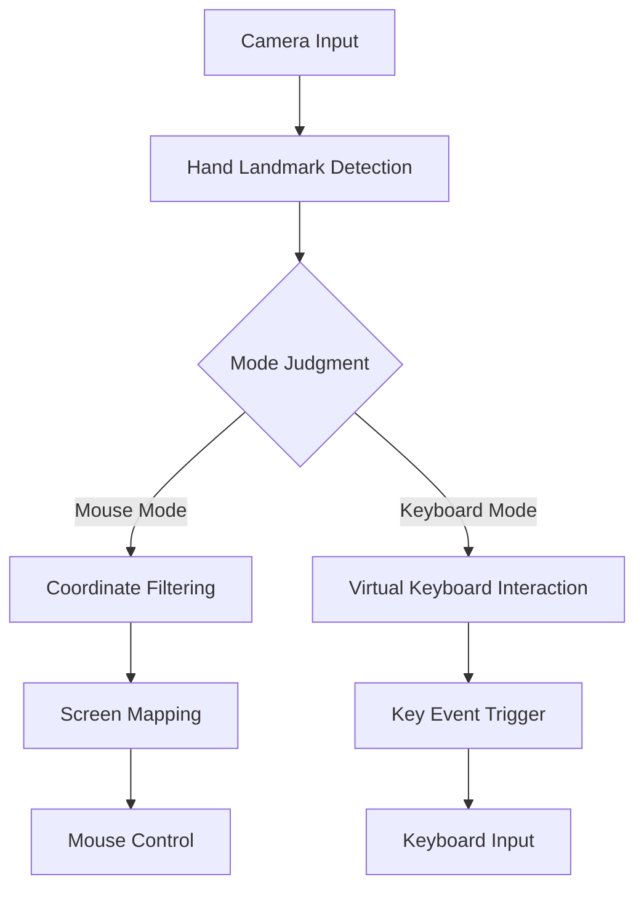

# Gesture Control System

A computer vision-based gesture interaction system implementing mouse cursor control and virtual keyboard input. 

## Technical Architecture


## Configuration
Modify `config.py` for customization:
```python
# Camera Settings
videoWidth = 1280
videoHeight = 1080

# Interaction Parameters
click_mode = 1       # 0: Index-Middle click | 1: Index-Thumb pinch
click_interval = 1   # Minimal click interval (seconds)
switch_delay = 0.3   # Mode switch cooldown
```

## Quick Start
// TODO
